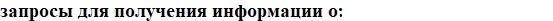

### Старт Сервиса
1. Cоздать базу данных "dbForRest"   
   CREATE DATABASE dbForRest;

Общая страница эдпоинтов 
>http://localhost:8080/swagger-ui/index.html#/

### Задание 2.

a)всех различных названий и стоимостей книг;

>http://localhost:8080/swagger-ui/index.html#/book-controller/nameAndPrice

b)всех различных районов, в которых проживают покупатели;

>http://localhost:8080/swagger-ui/index.html#/customer-controller/differentArea

c)всех различных месяцев, когда производились покупки.

>http://localhost:8080/swagger-ui/index.html#/buy-controller/getDifferentMonths

### Задание 3.

a)	фамилиях и размере скидки всех покупателей, проживающих в Нижегородском районе;

>http://localhost:8080/swagger-ui/index.html#/customer-controller/surnameDiscountNizhegorodskiy

b)	названиях магазинов Сормовского или Советского районов;

>http://localhost:8080/swagger-ui/index.html#/store-controller/nameSormovoSovetskiy

c)	Названиях  и стоимости книг, в которых встречается слово Windows, или стоящих более 20000 руб. Вывод результатов организовать по названию и убыванию цены книг.

>http://localhost:8080/swagger-ui/index.html#/book-controller/nameAndPriceMore20000

a) фамилию покупателя и название магазина, где производилась покупка;

>http://localhost:8080/swagger-ui/index.html#/buy-controller/getSurnameAndShop

b) дату, фамилию покупателя, скидку, название и количество купленных книг.

>http://localhost:8080/swagger-ui/index.html#/buy-controller/getDateSurnameDiscountBookNameNum

a) номер заказа, фамилию покупателя и дату для покупок, в которых было продано книг на сумму не меньшую чем 60000 руб.

>http://localhost:8080/swagger-ui/index.html#/buy-controller/getBuySumMore60000

b) покупки, сделанные покупателем в своем районе не ранее марта месяца. Вывести фамилию покупателя, район, дату. Произвести сортировку;

>http://localhost:8080/swagger-ui/index.html#/buy-controller/getBuyInCustomerArea

c) магазины, расположенные в любом районе, кроме Автозаводского, где покупали книги те, у кого скидка от 10 до 15 %;

>http://localhost:8080/swagger-ui/index.html#/buy-controller/getStoreNotInAvtozAndDiscountFrom10To15

d) данные по покупке книг (название, район складирования, количество), приобретенных в районе складирования и содержащихся в запасе более 10 штук. Включить данные о стоимости и отсортировать по возрастанию. 

>http://localhost:8080/swagger-ui/index.html#/buy-controller/getBookBuyDetails